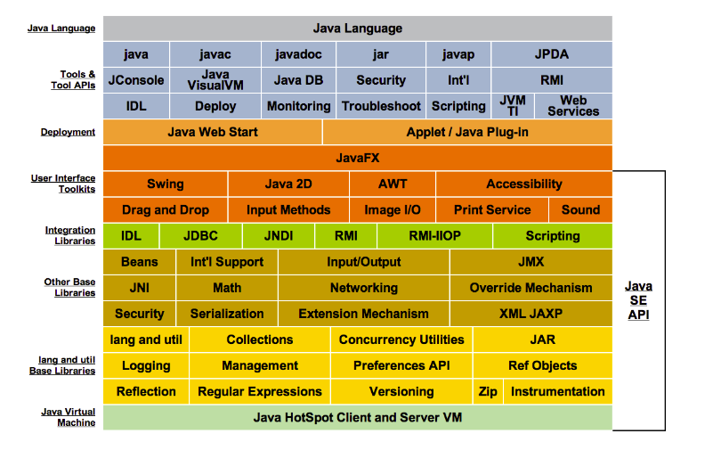
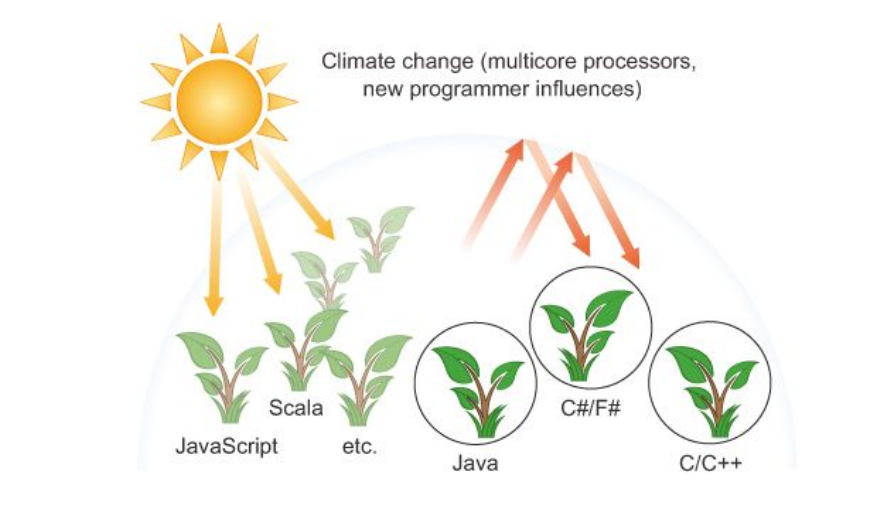

# Java8Features

## Java Development Kit (JDK) 8 | Java Platform, Standard Edition (Java SE) 8 | Long-Term-Support (LTS)

- Java Programming Language

    - Lambda Expressions, a new language feature, has been introduced in this release. They enable you to treat functionality as a method argument, or code as data. Lambda expressions let you express instances of single-method interfaces (referred to as functional interfaces) more compactly.

    - Method references provide easy-to-read lambda expressions for methods that already have a name.

    - Default methods enable new functionality to be added to the interfaces of libraries and ensure binary compatibility with code written for older versions of those interfaces.

    - Repeating Annotations provide the ability to apply the same annotation type more than once to the same declaration or type use.

    - Type Annotations provide the ability to apply an annotation anywhere a type is used, not just on a declaration. Used with a pluggable type system, this feature enables improved type checking of your code.

    - Improved type inference.

    - Method parameter reflection.
    
 Reference: https://www.oracle.com/technetwork/java/javase/8-whats-new-2157071.html

## Programming languages ecosystem and climate change

The main benefit of Java 8 to a programmer is that it provides more programming tools and
concepts to solve new or existing programming problems more quickly or, more importantly, in
a more concise, more easily maintainable way. Although the concepts are new to Java, they’ve
proved powerful in niche research-like languages. We highlight and develop the ideas behind
three such programming concepts that have driven the development of the Java 8 features to
exploit parallelism and write more concise code in general.

Reference: Book, Java 8 in Action: Lambdas, streams, and
           functional-style programming
           Raoul-Gabriel Urma, Mario Fusco, and Alan Mycroft

### Examples of new features Java 8

- Lambdas
- Functional interfaces
- Streams and Method References
- Collections
- Generics Wildcard
- Concurrency and Asynchronous Programming

