# Java8Features
Examples of new features Java 8

## Functional Interfaces

### BiConsumer
It represents an operation that accepts two input arguments and returns no result.

Examples:

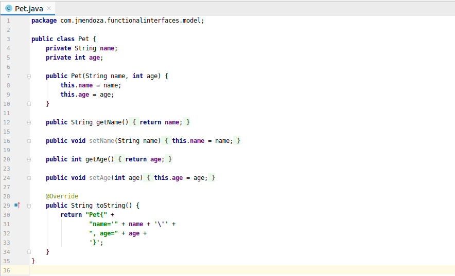

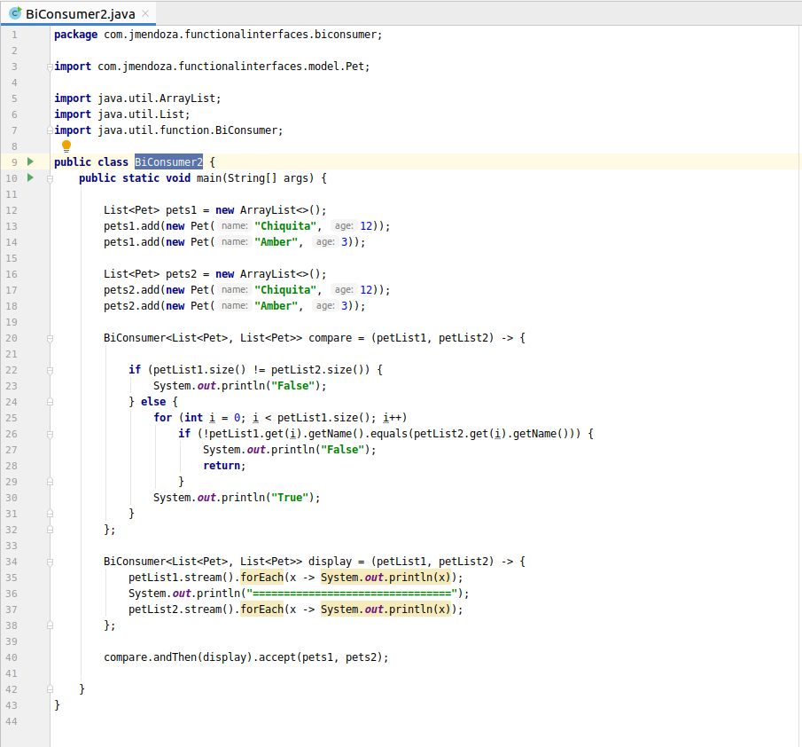

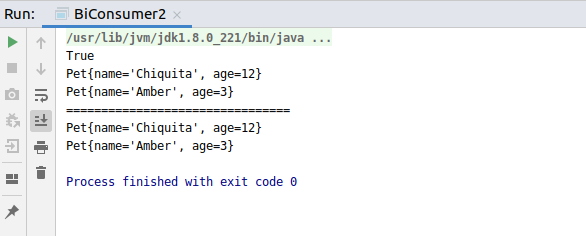

### BiFunction
It represents a function that accepts two arguments and returns a result.

Examples:

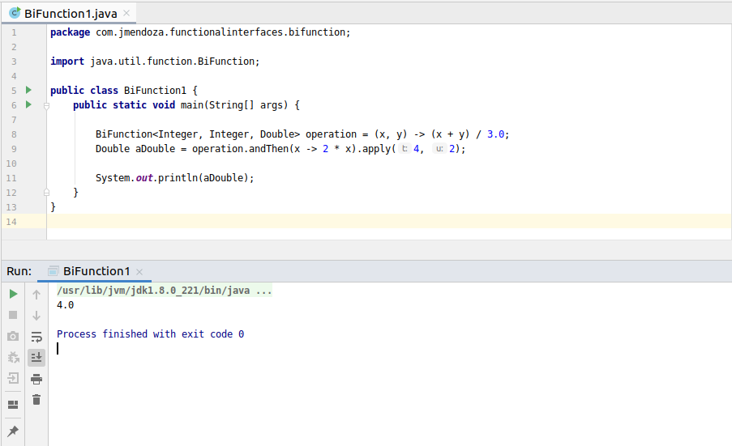

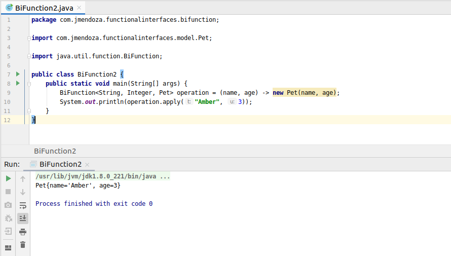

### Consumer
It represents an operation that accepts a single argument and returns no result.

Examples:

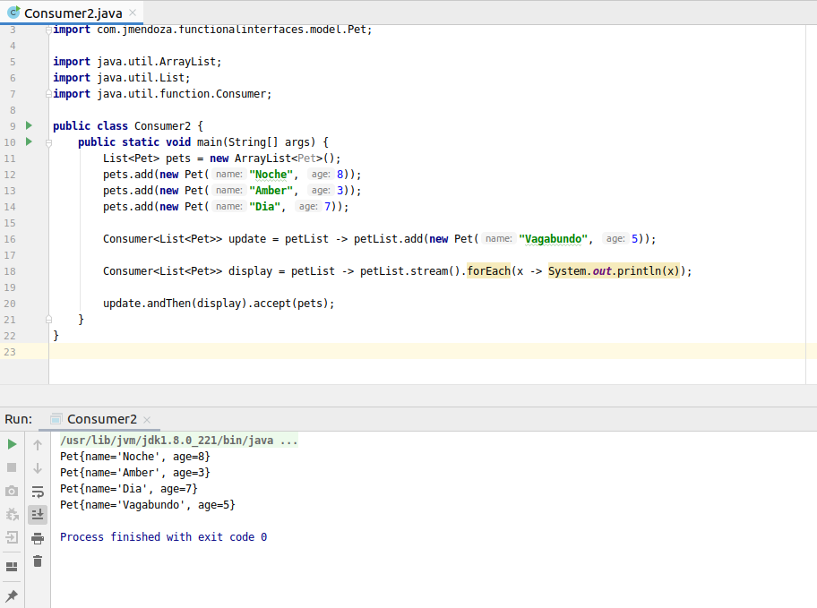

### Function
It represents a function that accepts one argument and returns a result.

Examples:

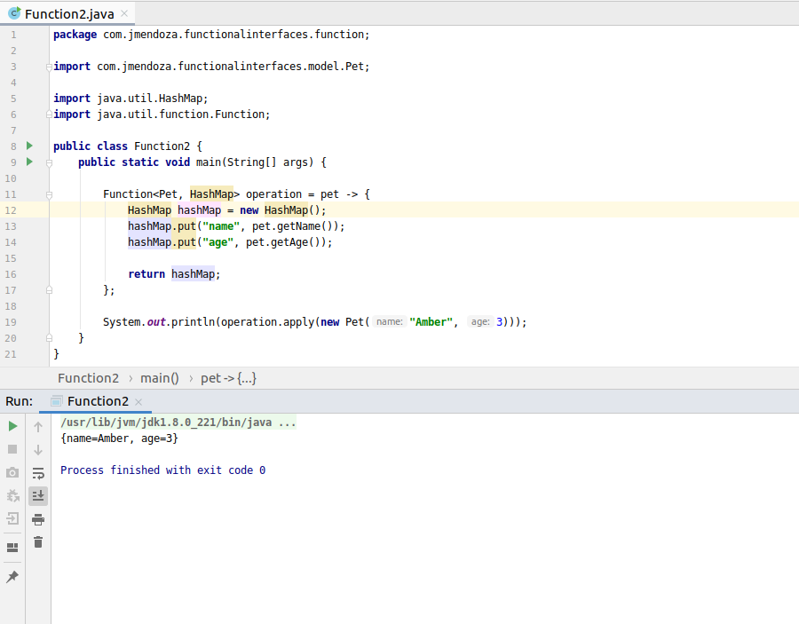

### Predicate
A Predicate is one such function accepting a single argument to evaluate to a boolean result.

Examples:

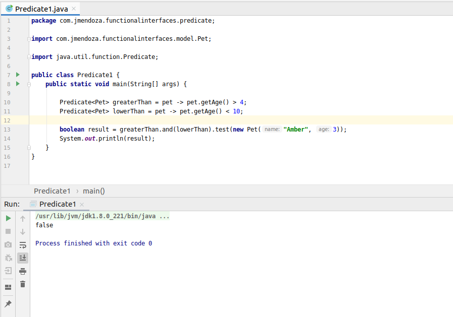

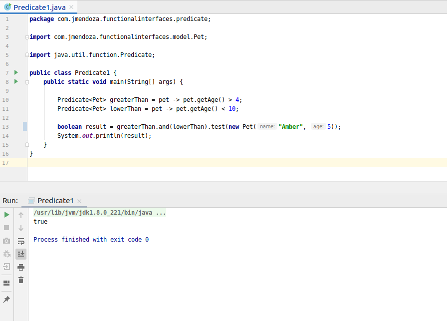

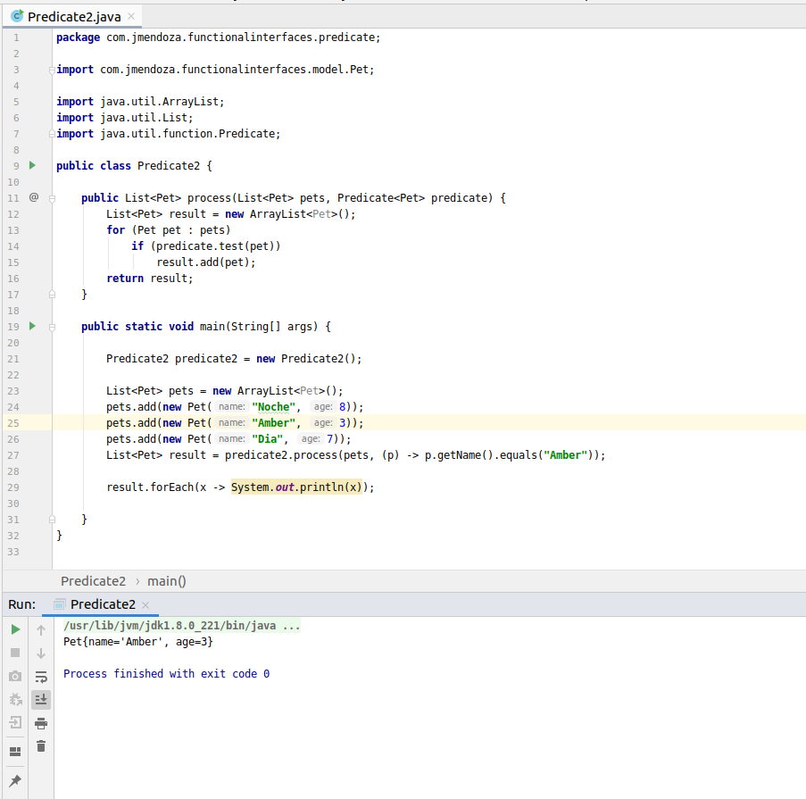

### Supplier
Represents a supplier of results.

Examples:

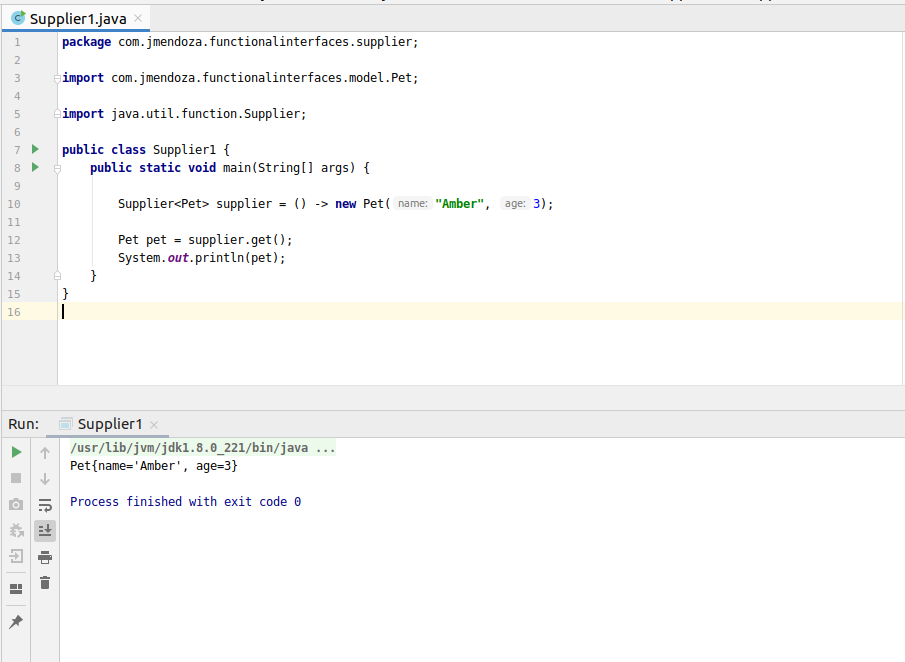

## Lambda Expressions

### Lambda Anonymous

Anonymous— We say anonymous because it doesn’t have an explicit name like a method would
normally have: less to write and think about!

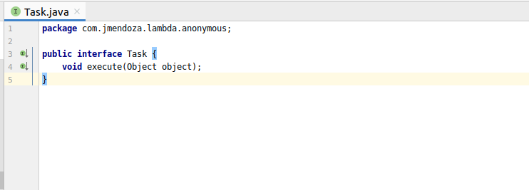

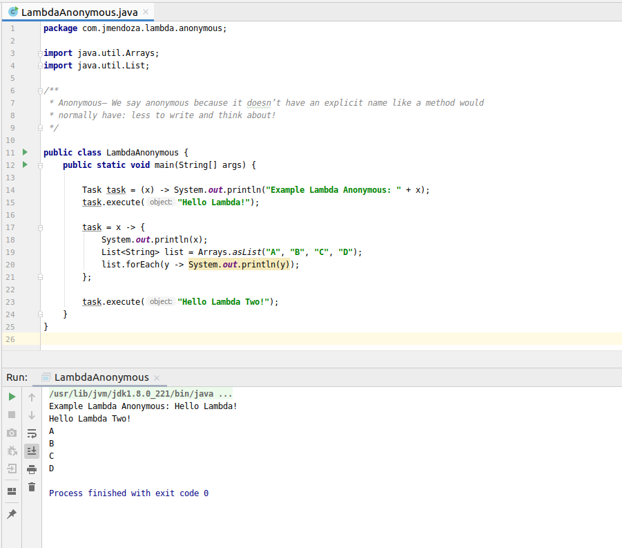

### Lambda Function

Function— We say function because a lambda isn’t associated with a particular class like a method is.
But like a method, a lambda has a list of parameters, a body, a return type, and a possible list of exceptions that can be thrown.

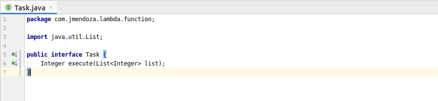

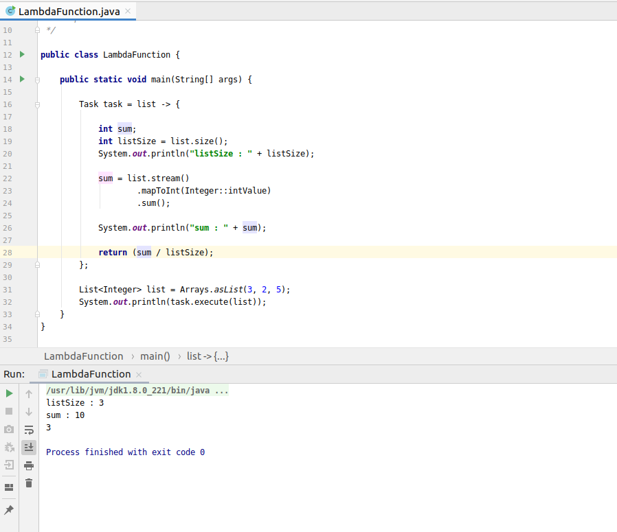

### Lambda Parameters

A lambda expression can have zero or any number of arguments. 

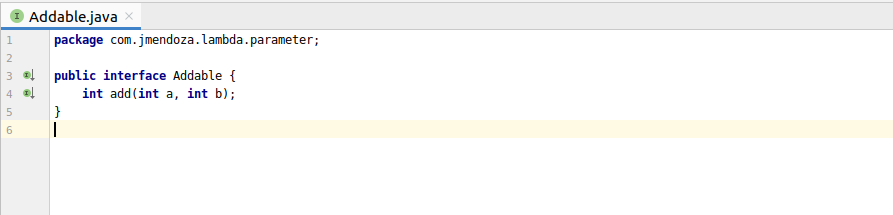

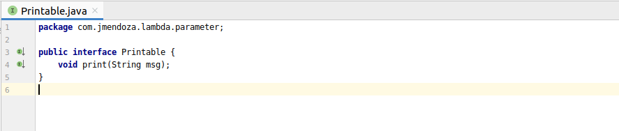

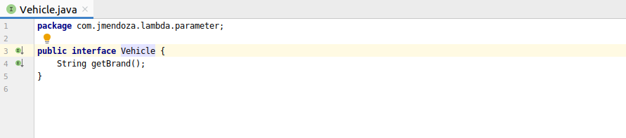

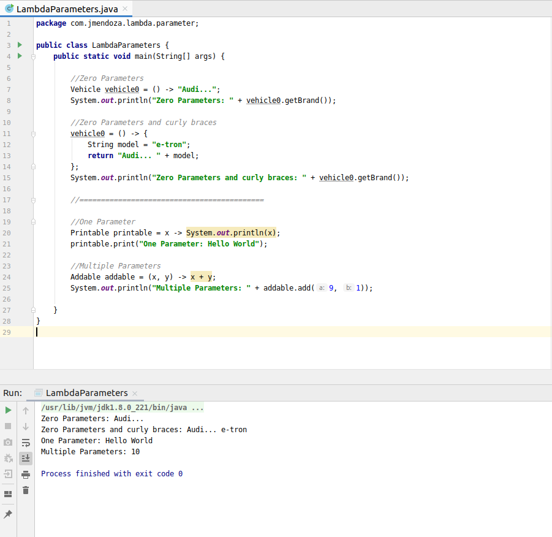

